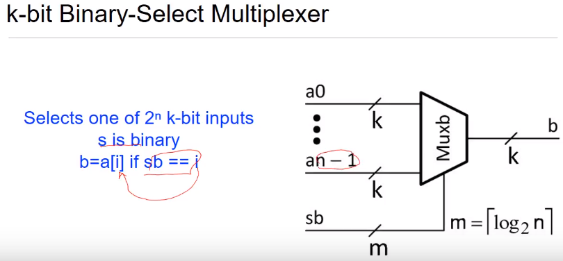

# Final Exam Review
## Representing Logic
### Combinational Logic
* Output has no memory, solely based on current inputs
### Sequential Logic
* Output values depend both on previous inputs and state of the logic based on previous inputs
## Boolean Algebra
### Identity 
0 ^ x = 0
1 v x = 1
### Indempotence
1 ^ x = x
0 v x = x
x ^ x = x
x v x = x
### Associative
x ^ (y ^ z) = (x ^ y) ^ z
### Distributive
x ^ (y v z) = (x ^ y) v (x ^ z)
### Absorption 
x ^ (x v y) = x
x v (x ^ y) = x
### Combining
(x ^ y) v (x ^ ~y) = x
### DeMorgan's
~(x ^ y) = ~x v ~y
### Dual of a Boolean Function
* Replace ANDs with ORs
* Replace 0s with 1s and vice versa
* Example: dual of (a ^ b) v (b ^ c) is (a v b) ^ (b v c)
### Complement of a Function
~f(a, b, c, ...) = dual of f where variables are inverted
## Truth Table to Boolean Logic
### Minterm
* An expression that ANDs all the inputs of the function in direct or negated forms
* Ex. minterms of f(a, b, c) are a ^ b ^ c, ~a ^ b ^ c, ~a ^ ~b ^ c, etc.
### Maxterm
* Expression that ORs together all the inputs of a function in direct or negated forms
* Ex. maxterms of f(a, b, c) are a v b v c, ~a v b v c, ~a v ~b v c, etc.
### Relationship of Minterms and Maxterms
* A truth table row for 0000 has minterm ~d ^ ~c ^ ~b ^ ~a, and maxterm d v c v b v a
* Note that a minterm of a row equals the inverse of its maxterm

### Disjunctive Normal Form
* Minterms ORed in a sum-of-products
* Fully disjunctive normal form: we ONLY OR minterms in a sum-of-products; every single term has all inputs. If it's missing an input, it is not fully
### Conjunctive Normal Form
* Maxterms ANDed in a product-of-sums
## Logic Reduction (Karnaugh Maps)
* Implicant: a product term that is true implies that the function is true
* Prime implicant: aan implicant that cannot be made any larger and still be an implicant
* Essential prime implicant: prime implicant that is the only containing a particular minterm
1. Generate K-map in order 00, 01, 11, 10
2. Group all adjacent 1s without including 0s
   * Each group (prime implicant) must be rectangular and a size that is a power of 2
3. An essential prime implicant contains at least 1 minterm not included in any other groups
4. Sum all essential groups to obtain a minimum sum of products
## Encoders and Decoders
### One-Hot
* Represent n elements with n bits, exactly one bit is set
* Example: encode numbers zero through 7
  1. binary 000 = one-hot 00000001 = decimal 0
  2. binary 001 = one-hot 00000010 = decimal 1
  3. binary 010 = one-hot 00000100 = decimal 2 and so on
### Decoder
* Converts symbols from one encoding to another
* A binary to one-hot decoder converts a symbol from binary to one-hot

#### 6 to 64 decoder from three 2 to 4 decoders

### Encoder
* Inverse of a decoder, converts one-hot input to binary output

### Multiplexer
* n inputs of k bits
* n-bit one-hot select signal s
* Used as data selector; selects on of n k-bit inputs

### Tri-State Gates
* Type of multiplexer that can disconnect input from output

### k-bit Binary Select Multiplexer

### 16:1 mux using five 4:1 muxes

## Arbiters and Comparators
### Arbiter
* Accepts n inputs, outputs one-hot of size n
* Grants the 1 to the requesting bit with highest priority
### Equality Comparator
* Accepts two inputs of size n, outputs 1 if equal and 0 if not
### Magnitude Comparator
* Accepts two inputs of size n, outputs 1 if the first input is larger than the second
## Integers in Binary
### Convert Decimal to Binary
* Divide decimal number by 2, write remainder as LSB (right-most)
### Convert Decimal to Binary to Hex
* Divide decimal number by 2, write remainder as LSB (right-most)
* Split binary into groups of four from right; convert each group to a hex symbol (0-F)
### Negative Numbers
#### Sign Magnitude
* Add an extra bit on the left side: 0 for positive, 1 for negative
#### One's Complement
* Just flip the bits
#### Two's Complement
* Represents a number -x as 2n - x
* Starting from the right, keep everything up to the LSB (the right-most 1). Flip the rest.
## Real Numbers
### Binary Coded Decimal
* Simply represent each decimal digit as a block of 4 binary bits
  * For example, 27.183 would be 0010 0111. 0001 1000 0011
### Binary Fixed Point
* Represent integer part normally in binary. After decimal, left-most bit is a half, second left-most is a quarter, third left-most is an eighth, etc.
1. Write integer part in binary
2. Keep multiplying decimal portion by 2. Write the resulting integer (1 or 0) as the leftmost decimal place each time
### Binary Floating Point
* Left-most bit is sign
### IEEE 32-Bit Floating Point Format
* Left-most bit is sign (1=neg), next eight are exponent, last 23 are mantissa
1. Represent left side of decimal in binary form
2. Represent right side of decimal in binary form
   * Multiply decimal part of original number by 2. Left side of result is bit. Right side gets multiplied by 2. Repeat until pattern found.
3. Concatenate steps 1 and 2. Shift decimal to the left to get into scientific notation. For each shift, multiply by two. For example, eight shifts requires the number to be multiplied by 28
4. Convert to IEEE format.
   1. Sign bit: set as necessary
   2. Exponent: add scientific notation exponent to 127 (bias). Convert result to 8-bit binary
   3. Mantissa: take RHS of scientific notation. Stop mantissa at 23 bits to get 32 total bits.
### Error
* R(x) is binary number representing real number x
* V(b) is value of binary number
* Absolute error = |V(R(x))-x|. Absolute accuracy is the max absolute|error|
  * Gives a number
* Relative error = |(V(R(x))-x)/x|. Relative accuracy is max relative |error|
  * Gives a percentage
### Half Adder
* No carry input

### Full Adder
* Carry input, carry output, sum output

### Multiplication

### FSM

### Moore FSM
* Output logic does not depend on input; it only depends on the current state

### Mealy FSM
* Output logic depends on input and current state

### D Flip-Flop

## Time and Delay
* Propagation delay - time from last input change until last output change (minimum delay)
* Contamination delay - time from first input change until first output change (maximum delay)

